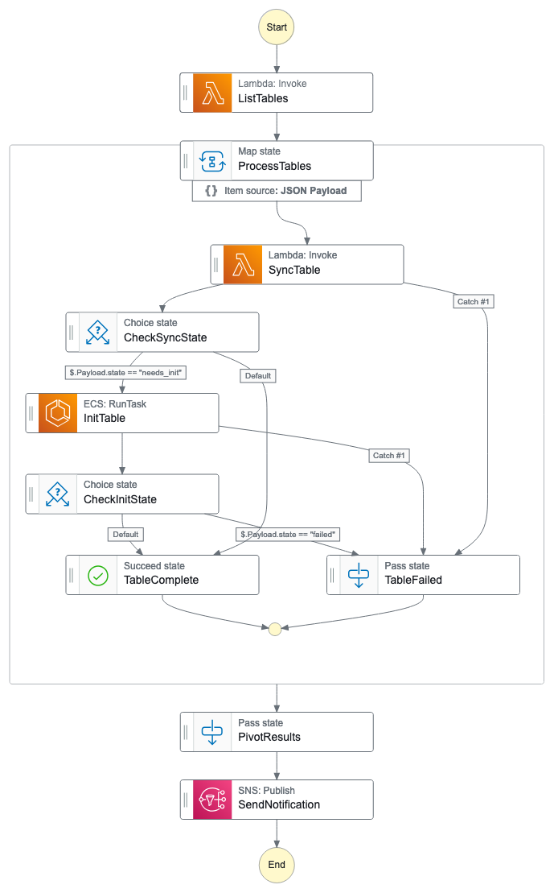

# Canvas Data 2 in AWS

A serverless application that initializes an Aurora Serverless database with data from [Canvas Data 2](https://community.canvaslms.com/t5/Admin-Guide/What-is-Canvas-Data-2/ta-p/560956) using the [Instructure DAP client](https://pypi.org/project/instructure-dap-client/). The application runs every three hours to sync data. 

**This project is actively under development.**

## Overview
The application uses Step Functions to orchestrate a workflow:

1. The State Machine is executed on a schedule via EventBridge.
2. The first step executes the `ListTables` function which retrieves the list of tables from the Data Access Platform.
3. The list of tables is passed to the `ProcessTables` step which executes the following steps for each item in the list:
   1. The `SyncTable` function is executed. This returns `success` or `init_needed` (if the table doesn't exist in the database yet).
   2. The output of `SyncTable` is checked by `CheckSyncState`. If the table successfully synced, the iteration is complete. If `init_needed` is returned, the `InitTable` task is executed.
   3. The output of `InitTable` is checked by `CheckInitState`.
4. Once the list is processed by `ProcessTables`, the results are joined and a notification is sent to an SNS topic



## Deployment
You can deploy this application to your AWS account with the Serverless Application Model (SAM) CLI. The SAM CLI is an extension of the AWS CLI that adds functionality for building and testing serverless applications. It uses Docker to run your functions in an Amazon Linux environment that matches the Lambda environment. It can also emulate your application's build environment and API.


### Prerequisites
A working knowledge of AWS services is beneficial. Before you can deploy the application, the following are required:

* A VPC
* One or more subnets where the Lambda functions and task can be deployed
* One or more subnets where the database cluster can be deployed
* [AWS CLI](https://aws.amazon.com/cli/)
* [SAM CLI](https://docs.aws.amazon.com/serverless-application-model/latest/developerguide/serverless-sam-cli-install.html)
* [Python 3](https://www.python.org/downloads/)
* [Docker Engine](https://docs.docker.com/engine/install/)


### 1. Build and deploy the application (Needs Updates)

To build and deploy your application for the first time, run the following in your shell:

```bash
sam build
sam deploy --guided
```

The first command builds the source of your application.
The second command packages and deploys your application to AWS, with a series of prompts:

* **Stack Name**: The name of the stack to deploy to CloudFormation. This should be unique to your account and region, and a good starting point would be something matching your project name.
* **AWS Region**: The AWS region you want to deploy your app to.
* **Confirm changes before deploy**: If set to yes, any change sets will be shown to you before execution for manual review. If set to no, the AWS SAM CLI will automatically deploy application changes.
* **Allow SAM CLI IAM role creation**: Many AWS SAM templates, including this example, create AWS IAM roles required for the AWS Lambda function(s) included to access AWS services. By default, these are scoped down to minimum required permissions. To deploy an AWS CloudFormation stack which creates or modifies IAM roles, the `CAPABILITY_IAM` value for `capabilities` must be provided. If permission isn't provided through this prompt, to deploy this example you must explicitly pass `--capabilities CAPABILITY_IAM` to the `sam deploy` command.
* **Save arguments to samconfig.toml**: If set to yes, your choices will be saved to a configuration file inside the project, so that in the future you can just re-run `sam deploy` without parameters to deploy changes to your application.

### 2. Configure the database

Deploying the application creates:

- An Aurora Serverless PostgreSQL cluster
- A database user credential in Secrets Manager

In order for the application to use that credential to connect to the database, a database user must be created and granted appropriate privileges. After deploying the SAM app, run the helper script. You must have valid [AWS credentials](https://docs.aws.amazon.com/IAM/latest/UserGuide/security-creds.html) before running the script.

The script requires the stack name returned by the SAM deploy command.

```
pip install setup/requirements.txt -r
./setup/prepare_aurora_db.py --stack-name <STACK_NAME>
```

### 3. Set configuration values

In order for the application to use the DAP API, you need to provide [a client ID and secret](https://community.canvaslms.com/t5/Admin-Guide/How-do-I-generate-a-Canvas-Data-2-API-key/ta-p/560955).

The application uses SSM Parameter Store to securely store and retrieve these values at runtime. To store your client ID and secret, use the following commands or create the parameters using the AWS console.

Set `<ENVIRONMENT>` in these commands to one of:

* `dev`
* `stg`
* `prod`
 

```
aws ssm put-parameter --name '/<ENVIRONMENT>/canvas_data_2/dap_client_id' --type SecureString --value '<DAP_CLIENT_ID>'
aws ssm put-parameter --name '/<ENVIRONMENT>/canvas_data_2/dap_client_secret' --type SecureString --value '<DAP_CLIENT_SECRET>'
```

### 4. Additional configuration

By default the database does not have a public IP address. You need to [configure network access](https://docs.aws.amazon.com/vpc/latest/userguide/vpc-security-groups.html) to the database per your organization's cybersecurity requirements.


## Operational considerations

### Manually trigger a workflow
By default, the workflow that synchronizes the database will run every three hours. You can also run the workflow manually via the AWS Console:

1. Navigate to the Step Functions service
2. Select `CD2RefreshStateMachine` in the list
3. Click the `Start execution` button.

### Lambda execution limits

The application uses AWS Lambda to run the `ListTables` and `SyncTables` steps. Lambda executions are limited to 15 minutes. If the steps take longer than the execution limit, the workflow will fail. You will be able to see the error in the AWS Step Functions console.

### Schema changes
Occasionally the schema for a CD2 table will change. The DAP library will take care of applying these changes to the database, but they will not succeed if you have created views that depend on the table. The `SyncTables` step will attempt to drop dependencies (eg. views) and restore them.

## Clean-up

To delete the application that you created, run the following command. <STACK_NAME> is the stack name returned by the SAM deploy command.

```bash
aws cloudformation delete-stack --stack-name <STACK_NAME>
```

Alternatively, you can delete the stack in the AWS console using the CloudFormation service.